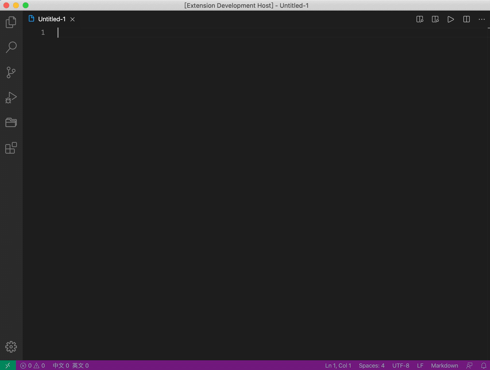
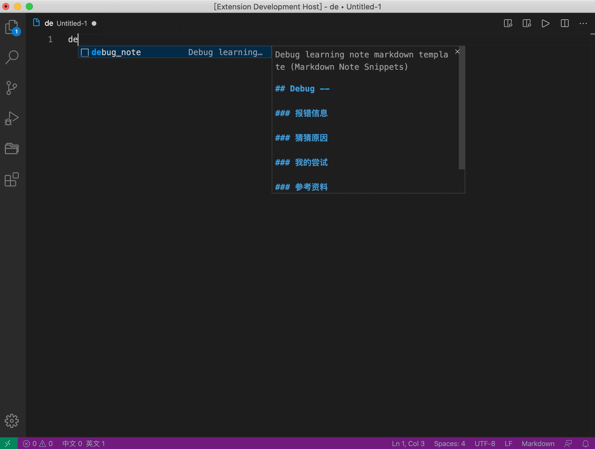
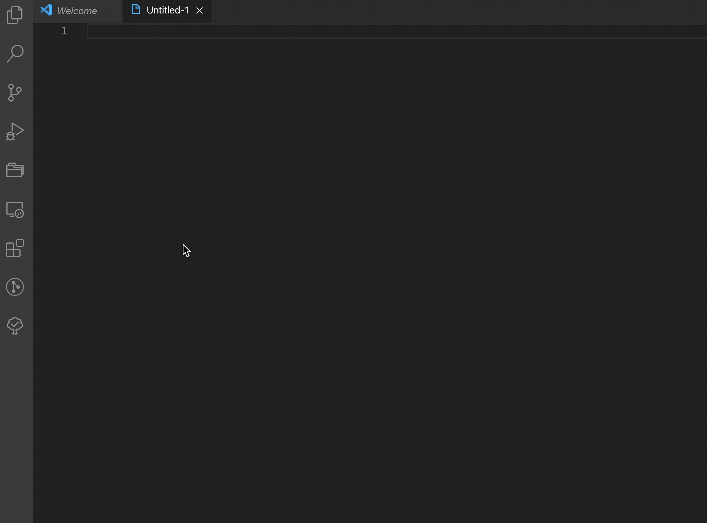

# Markdown Note Snippets

**Note**: The markdwon snippets extension is only for Chinese now.

## 关于

VS code 目前是我的主力代码编辑器，在大多数时候也是我的主力文本编辑器。为了在用 VS code 写文献阅读笔记和读书笔记时更加顺手，我根据自己的阅读和记录习惯整理了一些 markdwon 模板，所谓模板其实就是若干适用于 markdown 的 snippets。为了让有需要的朋友也能用上这些 snippets，我把它们打包成了现在的插件，方便安装与使用。

目前这个插件非常简单，只引入了少数 snippet，但后期会一直升级迭代。主要目的是为了熟悉 VS code 插件的开发及发布流程。

## 使用方法

本插件在 markdown 文本中会自动触发，目前仅有 5 个模板可以使用。

**说明**：有部分用户反馈在在 Markdown 文档中 snippet 无法触发，原因可能是 Markdown 文本在默认设置中并没有开启`editor.quickSuggestions`选项，可以尝试在配置文件中写入如下设置：

```
"[markdown]": {
  "editor.quickSuggestions": {
    "other": true,
    "comments": false,
    "strings": true
  },
},
```

### 文献精读模板

在编辑器内输入 `intensive_reading` 会自动出现精读模板提示，摁下 `Enter` 即可插入模板。因为精读笔记通常一次只读一篇，所以在模板中引入了一级标题，标题为`文献精读+当前日期`，例如`文献精读2019-09-09`。

随后的内容包括包括文献信息、文献概述、好词好句、文献笔记和相关文献等内容。且光标首先会定位在`标题`行后面，输入标题之后直接按下 `Tab` 键会自动定位在 DOI 处，然后依次定位在发表日期、发表杂志和关键词后，方便输入。


### 文献泛读模板

在编辑器内输入 `extensive_reading` 会自动出现泛读模板提示，摁下 `Enter` 即可插入模板。因为泛读笔记通常一次会读两到三篇，所以在模板中并未引入一级标题，而是使用了二级标题。包括文献信息、关键点、参考意义和相关内容。光标首先会定位在`标题`行位置，输入标题之后直接按下 `Tab` 键会自动定位在 DOI 和发表日期对应位置。



### KPT 每日工作记录模板

在编辑器内输入 `kpt_daily` 会自动出现 KPT 每日工作记录模板提示，摁下 `Enter` 即可插入模板。KPT 三个字母分别代表 Keep、Problem 和 Try。具体含义如下：

- Keep: 当前你正在做的事，不要过于宽泛
- Problem：今日所遇到的问题
- Try：你准备明天要尝试的解决方案


### Debug 过程记录模板

在编辑器内输入 `debug_note` 会自动出现 Debug 过程记录模板提示，摁下 `Enter` 即可插入模板。该模板包括：报错信息、猜猜原因、我的常识、参考资料和解决方案五部分。可以比较好的记录整个 Debug 过程。

建议使用方法为首先复制好报错信息，然后再插入模板，此时光标会自动定位在报错信息下的代码框内，直接复制即可保存报错信息。



### 闪念胶囊写作素材记录模板

在编辑器内输入 `idea_pills` 会自动出现闪念胶囊写作素材记录模板提示，摁下 `Enter` 即可插入模板。该模板包括：话题、灵感来源和写作思路三部分。其中灵感来源是那些让你产生表达冲动的内容，可能是看到一篇好的文章或者和朋友的偶然闲聊。


### 5 分钟日记模板

关于 5 分钟日记模板相关介绍可以查看文章[21 天日记挑战-5 分钟日记法](https://kaopubear.top/blog/2020-08-06-21day5minjournal/)。

在编辑器内输入 `5min` 会自动出现闪念胶囊写作素材记录模板提示，摁下 `Enter` 即可插入模板。该模版包括 5 分钟日记中涉及到的 5 个问题。



## 更新日志

### 0.0.1 2019-09-06

- 增加文献精读和泛读笔记模板

### 0.0.2 2019-09-06

- 支持最低 VS code 版本为 1.37.0

### 0.0.3 2020-04-16

- 补充 Markdown 文本不能调用 snippet 的解决说明
- 增加 KPT 每日工作记录模板
- 增加 Debug 过程记录模板
- 增加闪念胶囊写作素材记录模板

### 0.0.4 2020-04-17

- 增加插件 icon
- 提交源代码至 GitHub

### 0.0.5 2020-08-25

- 增加 5 分钟日记模板

## 联系方式

如果有任何建议欢迎发送邮件至 `kaopubear@aliyun.com`

更多内容欢迎访问个人主页 [思考问题的熊](https://kaopubear.top)
